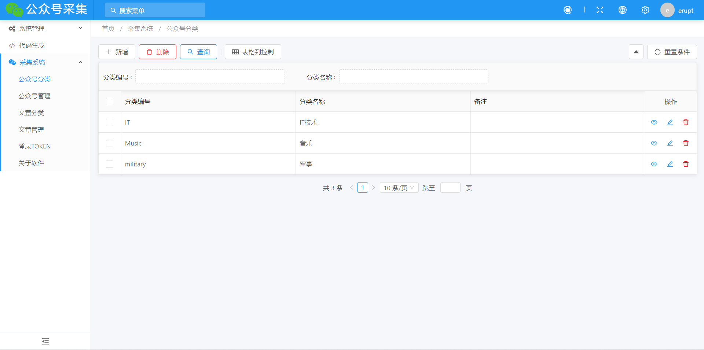
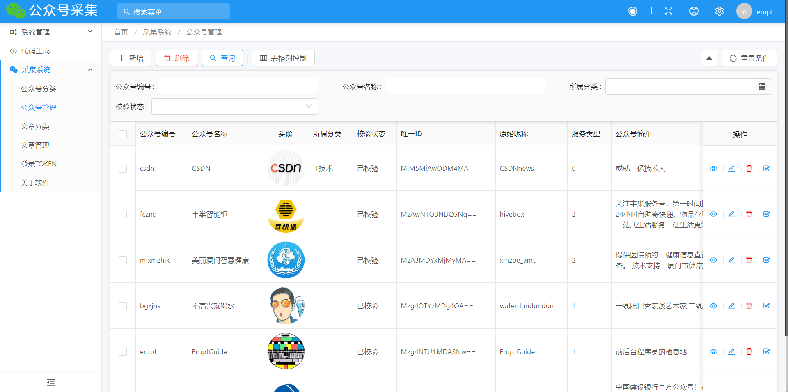
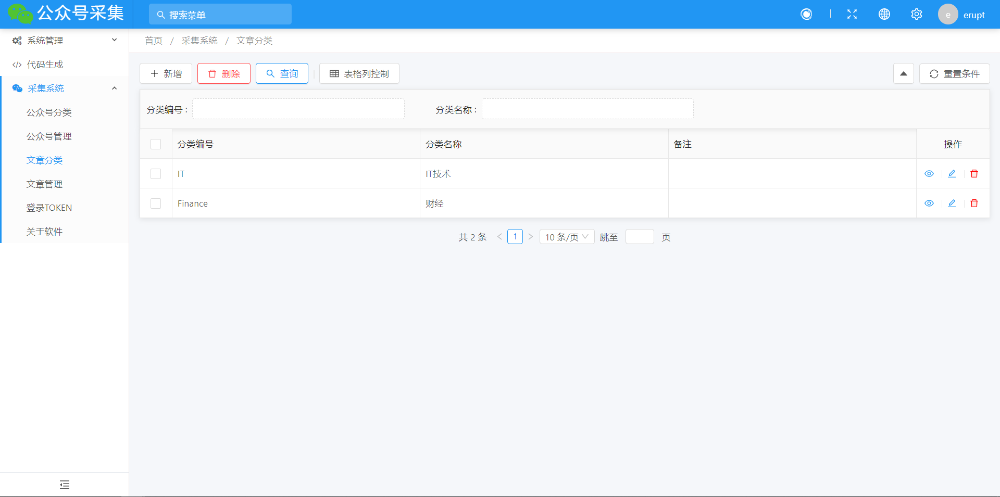
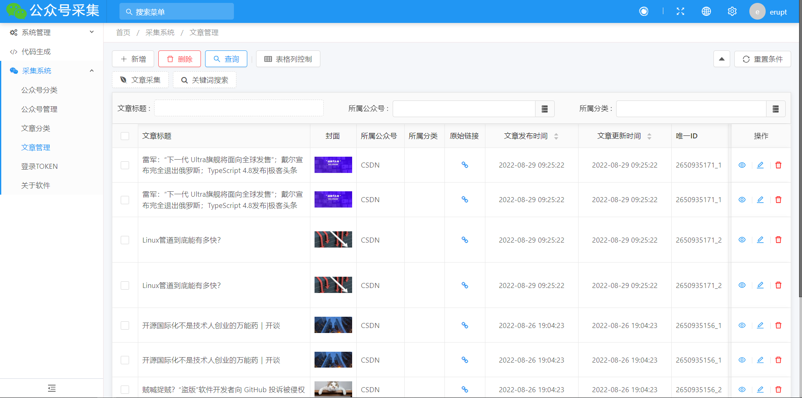
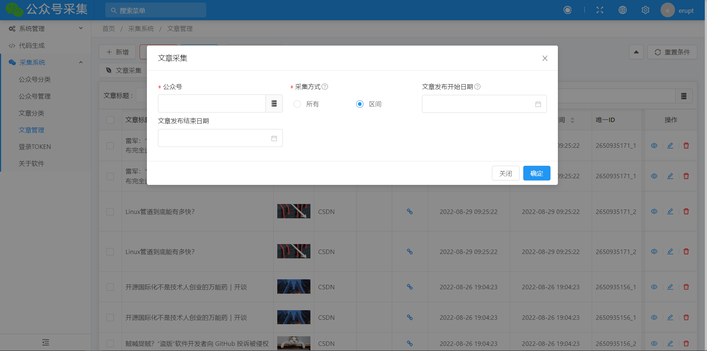
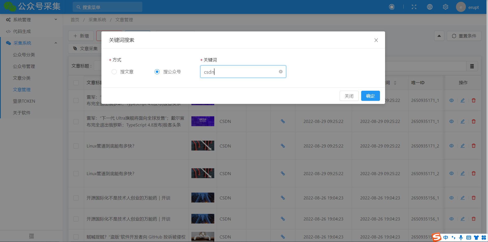

# Spring BOOT 实现公众号采集

[TOC]


使用 Spring Boot 实现的 WEB 界面采集公众号文章，按关键词搜索公众号等。文章采集前需要先扫码登录获取 TOKEN。

**采集频率不能太快**，否则会被微信官方限制，需要等待片刻，或者第二天才能解封。


### 一、功能列表

#### 1、公众号分类




#### 2、公众号管理




#### 3、文章分类




#### 4、文章管理

##### 4.1 文章列表，点击原始链接可查看文章




##### 4.2 文章采集




##### 4.3 关键词搜索，目前实现按公众号标题搜索




### 二、启动教程

修改`application.yml`配置即可。

```yaml
spring:
  datasource:
    url: jdbc:mysql://你的IP:3306/你的数据库?useUnicode=true&characterEncoding=UTF-8&serverTimezone=Asia/Shanghai
    username: root
    password: 密码
```

```yaml
erupt:
  uploadPath: D:/erupt/pictures
```


**数据库表和结构，项目第一次启动会自动创建。**

**不想手动创建业务系统菜单的，可以执行 sql 目录下的`e_upms_menu.sql`**


### 三、免责声明

本项目仅作学习交流，切勿用于非法途径。使用本项目造成的一切后果，本人概不负责。


### 四、开源协议

ZLIB

参考项目：[Java爬取公众号文章](https://gitee.com/iszsq/sq-weixin-api-demo)
